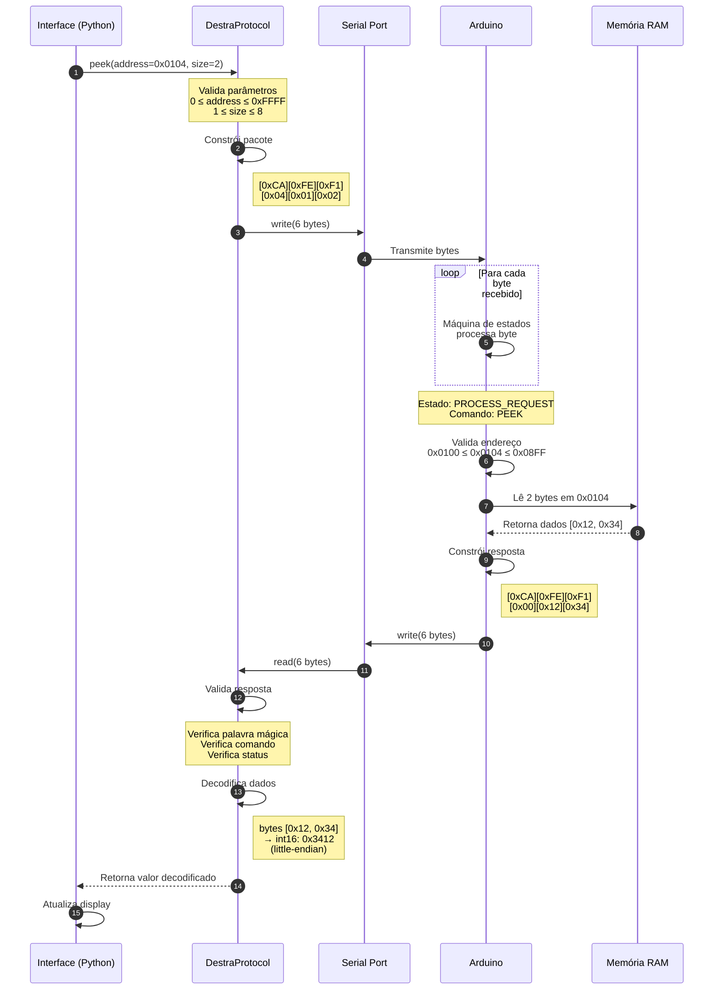
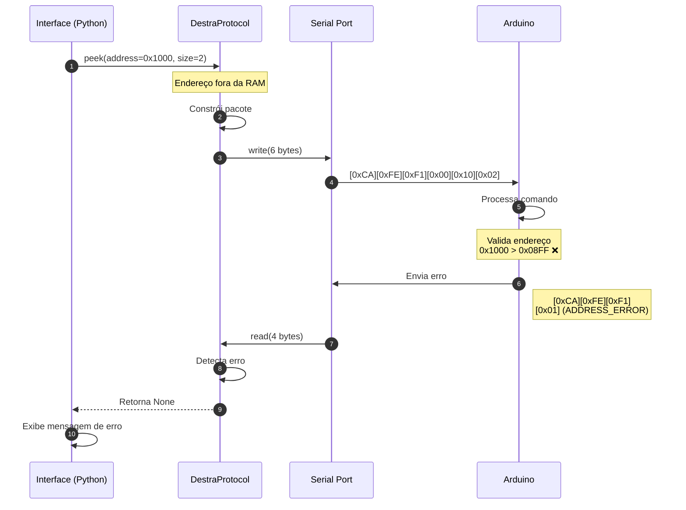
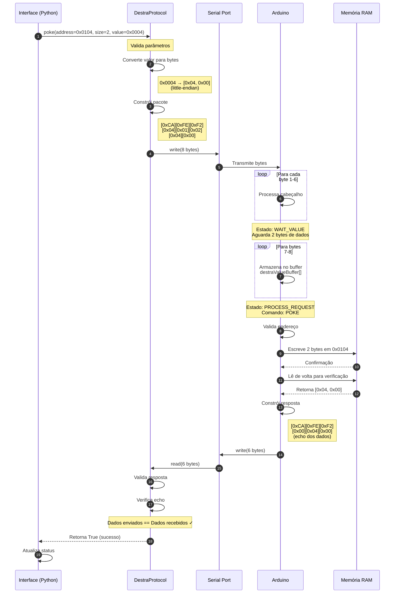
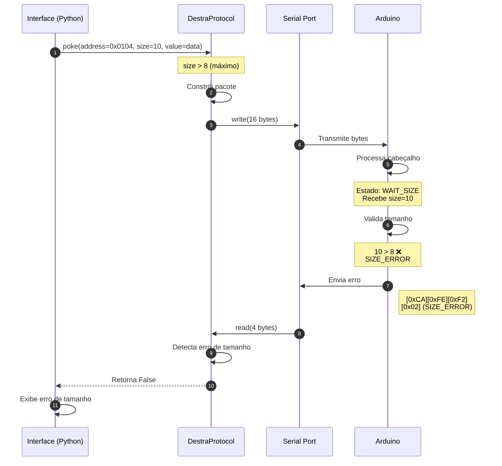
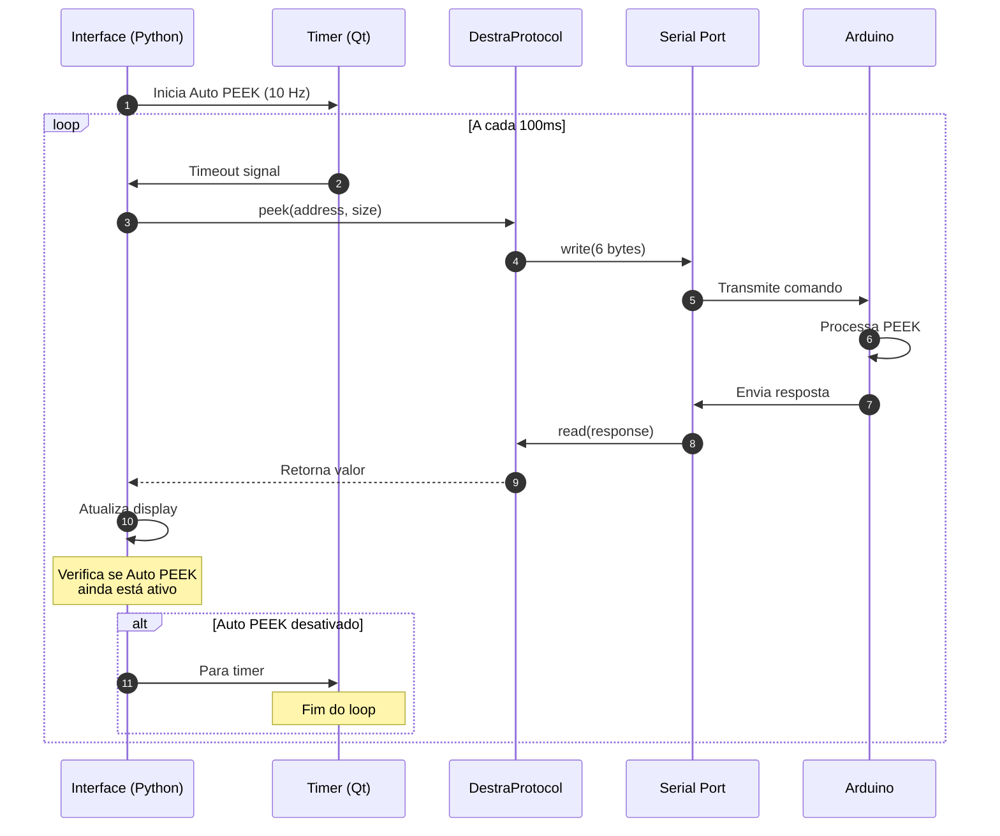
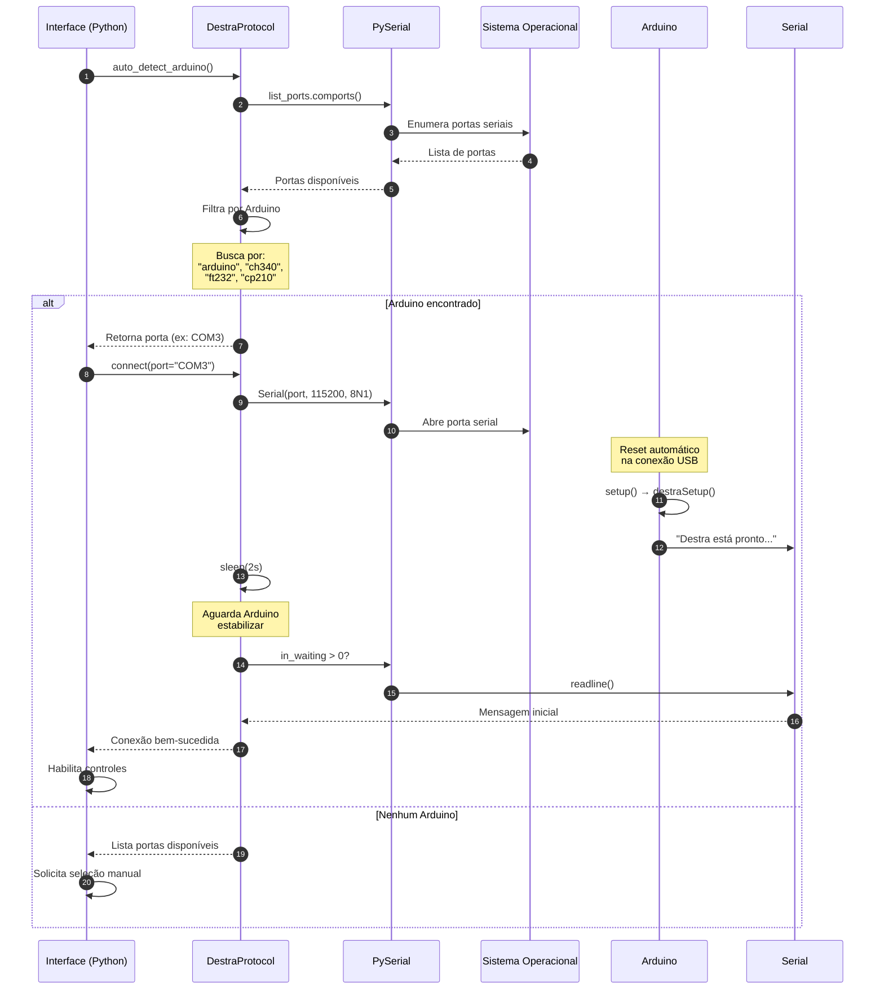
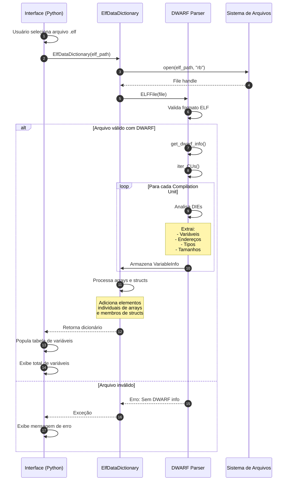
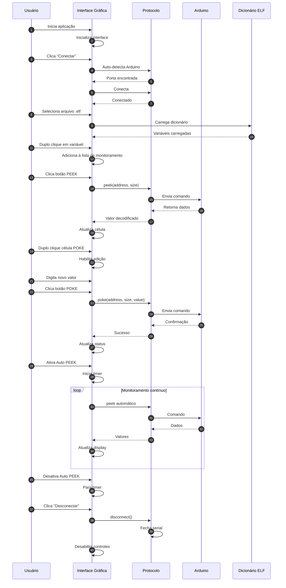
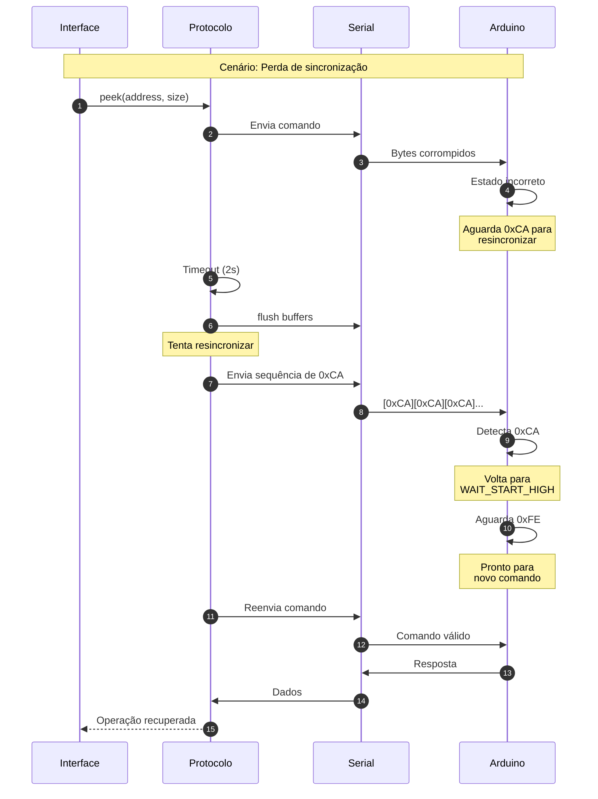
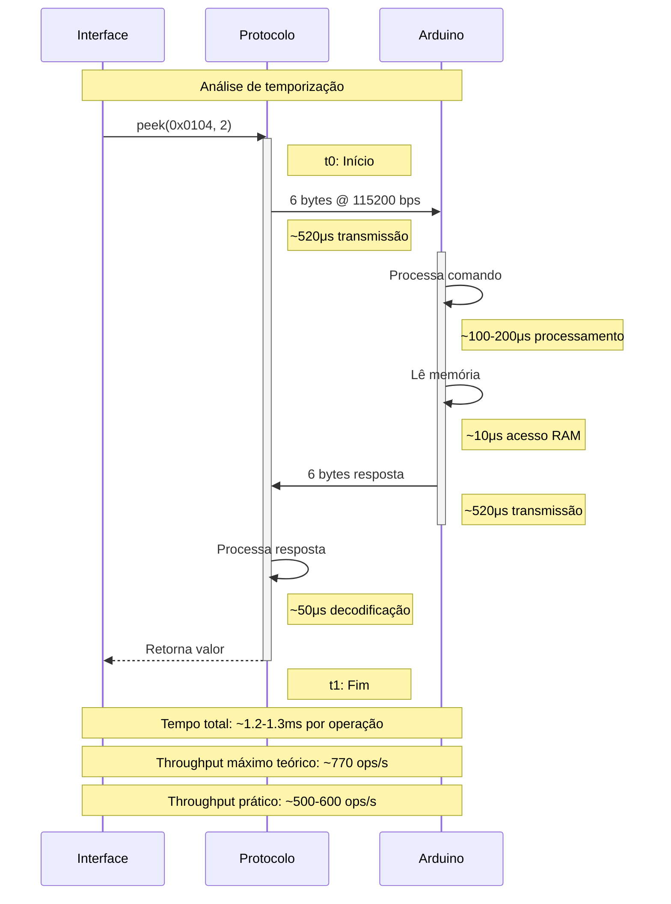

# Diagramas de Sequência - Protocolo DESTRA

## Visão Geral

Este documento apresenta os diagramas de sequência detalhados para as operações PEEK e POKE do protocolo DESTRA, mostrando a interação entre os componentes do sistema.

## Operação PEEK Completa

### Caso de Sucesso

### Caso de Erro - Endereço Inválido

## Operação POKE Completa

### Caso de Sucesso

### Caso de Erro - Tamanho Inválido

## Cenário de Auto PEEK Contínuo

## Fluxo de Inicialização e Conexão

## Fluxo de Carregamento do Dicionário de Dados

## Interação Completa do Usuário

## Tratamento de Erros e Recuperação

## Temporização e Performance

## Notas de Implementação

### Considerações de Design

1. **Protocolo Assíncrono**: A máquina de estados no Arduino processa bytes conforme chegam, sem bloqueio
2. **Palavra Mágica**: 0xCAFE permite resincronização rápida após erros
3. **Echo em POKE**: Verificação adicional de integridade dos dados escritos
4. **Timeout**: 2 segundos no lado Python para detectar falhas de comunicação

### Limitações Conhecidas

- **Bandwidth**: Limitado a 115200 bps (aproximadamente 11.5 KB/s)
- **Latência**: ~1-2ms por operação peek/poke
- **Buffer**: Máximo de 8 bytes por operação
- **Endereçamento**: 16 bits (0x0000-0xFFFF)
- **Concorrência**: Operações não são thread-safe

### Visualização dos Diagramas

Este documento utiliza sintaxe Mermaid para os diagramas de sequência. Para visualização:

1. **GitHub/GitLab**: Renderização automática no navegador
2. **VS Code**: Instalar extensão "Mermaid Preview" ou "Markdown Preview Mermaid Support"
3. **Online**: [Mermaid Live Editor](https://mermaid.live)
4. **Exportação**: Os diagramas podem ser exportados como PNG/SVG para documentação

## Referências

- Protocolo DESTRA: `arduino/sample/destra_protocol.ino`
- Implementação Python: `src/destra.py`
- Interface Gráfica: `src/destra_ui.py`
- Parser ELF/DWARF: `src/data_dictionary.py`

---

*Documento gerado para o projeto DESTRA - DEpurador de Sistemas em Tempo ReAl*  
*EESC - USP (2024)*
