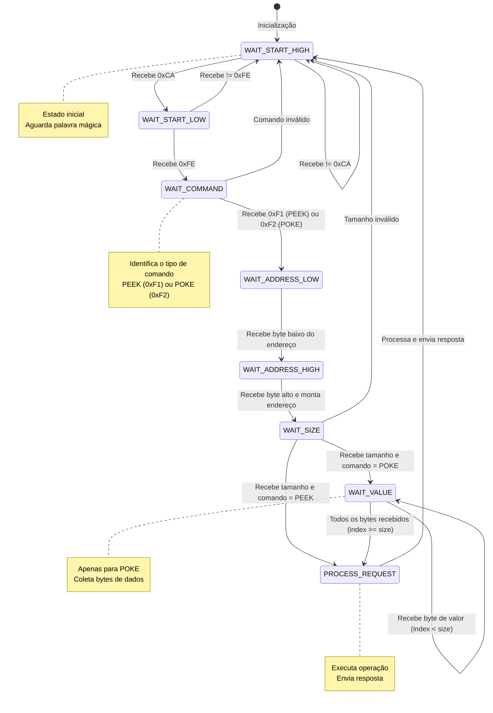
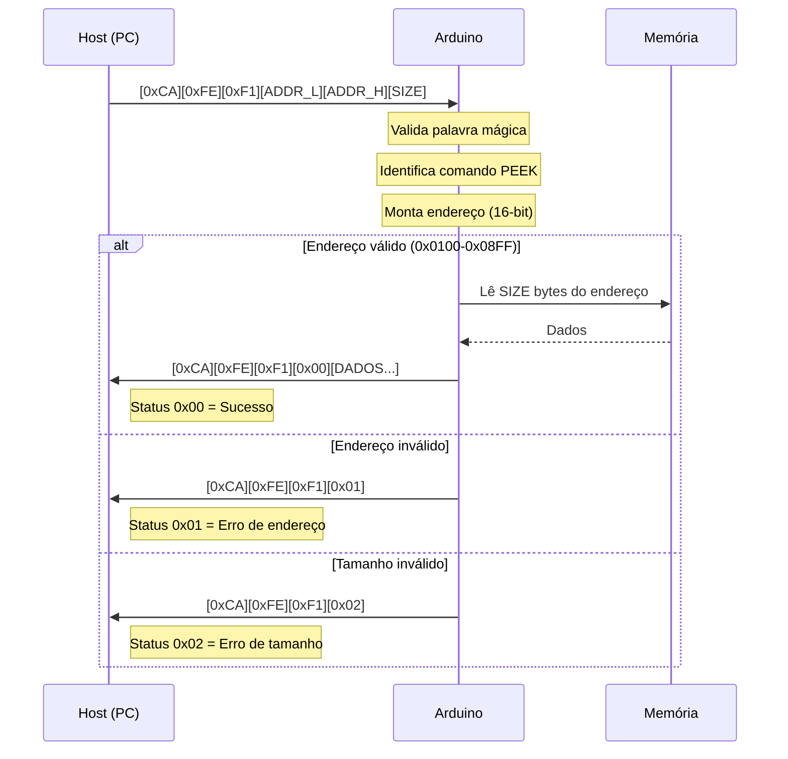
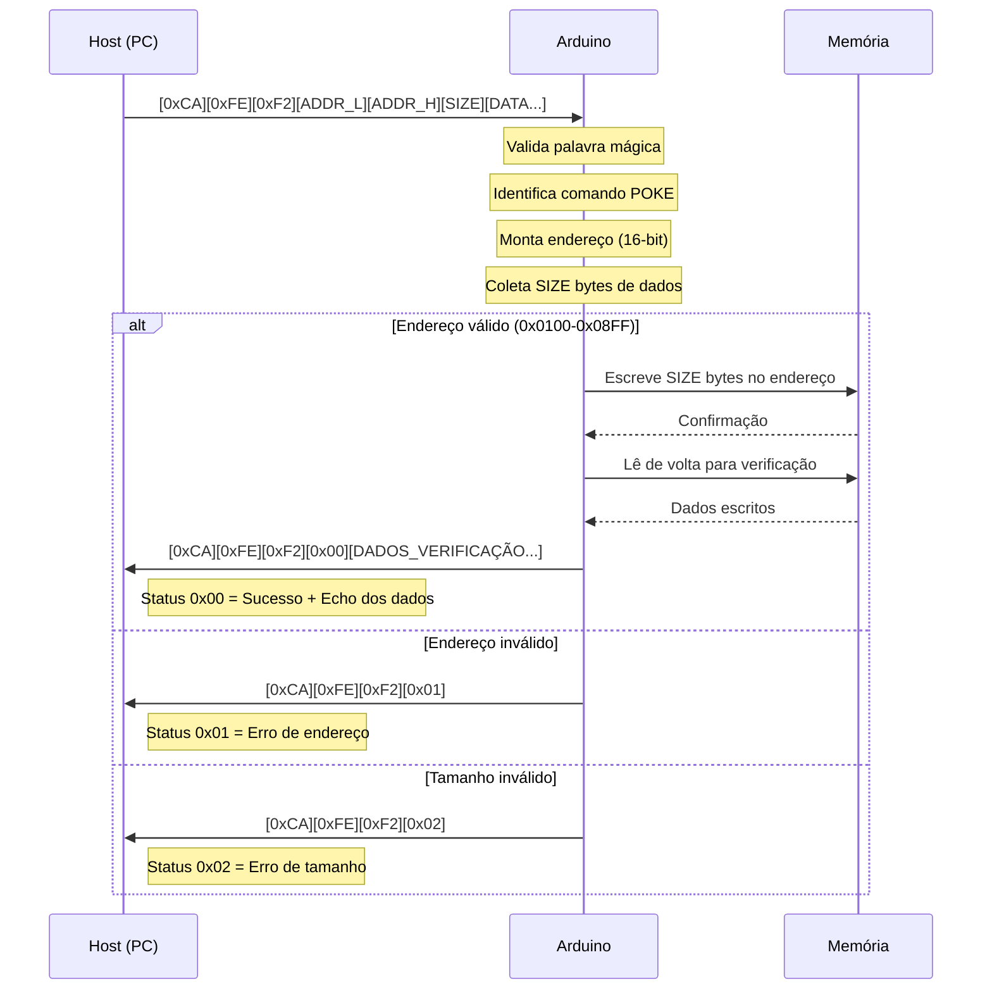

# Diagrama de Estados - Protocolo DESTRA

## Máquina de Estados do Protocolo DESTRA (Arduino)

Este diagrama representa a máquina de estados implementada no Arduino para processar os comandos PEEK e POKE do protocolo DESTRA.



## Fluxo de Processamento de Comandos

### Comando PEEK



### Comando POKE



## Estados Detalhados

### Tabela de Estados e Transições

| Estado | Descrição | Entrada | Próximo Estado | Ação |
|--------|-----------|---------|----------------|------|
| WAIT_START_HIGH | Aguarda byte alto da palavra mágica | 0xCA | WAIT_START_LOW | Armazena byte |
| | | Outro valor | WAIT_START_HIGH | Descarta |
| WAIT_START_LOW | Aguarda byte baixo da palavra mágica | 0xFE | WAIT_COMMAND | Confirma palavra mágica |
| | | Outro valor | WAIT_START_HIGH | Reset |
| WAIT_COMMAND | Aguarda comando | 0xF1 (PEEK) | WAIT_ADDRESS_LOW | Armazena comando |
| | | 0xF2 (POKE) | WAIT_ADDRESS_LOW | Armazena comando |
| | | Outro valor | WAIT_START_HIGH | Reset |
| WAIT_ADDRESS_LOW | Aguarda byte baixo do endereço | Qualquer byte | WAIT_ADDRESS_HIGH | Armazena addr_low |
| WAIT_ADDRESS_HIGH | Aguarda byte alto do endereço | Qualquer byte | WAIT_SIZE | Monta endereço 16-bit |
| WAIT_SIZE | Aguarda tamanho | 1-8 | PROCESS_REQUEST (PEEK) | Armazena tamanho |
| | | 1-8 | WAIT_VALUE (POKE) | Armazena tamanho, index=0 |
| | | 0 ou >8 | WAIT_START_HIGH | Reset (erro) |
| WAIT_VALUE | Aguarda bytes de dados (POKE) | Qualquer byte | WAIT_VALUE ou PROCESS_REQUEST | Armazena no buffer |
| PROCESS_REQUEST | Processa comando | - | WAIT_START_HIGH | Executa e responde |

## Exemplo de Processamento

### PEEK de uma variável int16 (2 bytes) no endereço 0x0104

```
Entrada (hex): CA FE F1 04 01 02
               └─┬─┘ │  └─┬─┘ │
                 │   │    │   └── Tamanho: 2 bytes
                 │   │    └────── Endereço: 0x0104 (little-endian)
                 │   └──────────── Comando: PEEK (0xF1)
                 └──────────────── Palavra mágica: 0xCAFE

Estados percorridos:
1. WAIT_START_HIGH → Recebe 0xCA → WAIT_START_LOW
2. WAIT_START_LOW → Recebe 0xFE → WAIT_COMMAND
3. WAIT_COMMAND → Recebe 0xF1 → WAIT_ADDRESS_LOW
4. WAIT_ADDRESS_LOW → Recebe 0x04 → WAIT_ADDRESS_HIGH
5. WAIT_ADDRESS_HIGH → Recebe 0x01 → WAIT_SIZE (endereço = 0x0104)
6. WAIT_SIZE → Recebe 0x02 → PROCESS_REQUEST
7. PROCESS_REQUEST → Lê memória e envia resposta → WAIT_START_HIGH

Resposta (hex): CA FE F1 00 XX XX
                └─┬─┘ │  │  └─┬─┘
                  │   │  │    └── Dados lidos (2 bytes)
                  │   │  └──────── Status: Sucesso (0x00)
                  │   └──────────── Comando: PEEK (0xF1)
                  └──────────────── Palavra mágica: 0xCAFE
```

### POKE escrevendo valor 0x0004 no endereço 0x0104

```
Entrada (hex): CA FE F2 04 01 02 04 00
               └─┬─┘ │  └─┬─┘ │  └─┬─┘
                 │   │    │   │    └── Valor: 0x0004 (little-endian)
                 │   │    │   └──────── Tamanho: 2 bytes
                 │   │    └──────────── Endereço: 0x0104 (little-endian)
                 │   └────────────────── Comando: POKE (0xF2)
                 └────────────────────── Palavra mágica: 0xCAFE

Estados percorridos:
1. WAIT_START_HIGH → Recebe 0xCA → WAIT_START_LOW
2. WAIT_START_LOW → Recebe 0xFE → WAIT_COMMAND
3. WAIT_COMMAND → Recebe 0xF2 → WAIT_ADDRESS_LOW
4. WAIT_ADDRESS_LOW → Recebe 0x04 → WAIT_ADDRESS_HIGH
5. WAIT_ADDRESS_HIGH → Recebe 0x01 → WAIT_SIZE (endereço = 0x0104)
6. WAIT_SIZE → Recebe 0x02 → WAIT_VALUE (size = 2, index = 0)
7. WAIT_VALUE → Recebe 0x04 → WAIT_VALUE (buffer[0] = 0x04, index = 1)
8. WAIT_VALUE → Recebe 0x00 → PROCESS_REQUEST (buffer[1] = 0x00, index = 2)
9. PROCESS_REQUEST → Escreve na memória e envia resposta → WAIT_START_HIGH

Resposta (hex): CA FE F2 00 04 00
                └─┬─┘ │  │  └─┬─┘
                  │   │  │    └── Echo dos dados escritos (verificação)
                  │   │  └──────── Status: Sucesso (0x00)
                  │   └──────────── Comando: POKE (0xF2)
                  └──────────────── Palavra mágica: 0xCAFE
```

## Características do Protocolo

### Robustez
- **Sincronização**: Palavra mágica 0xCAFE permite resincronização após erro
- **Validação**: Verificação de faixa de endereço e tamanho
- **Verificação**: POKE retorna echo dos dados para confirmação

### Performance
- **Não-bloqueante**: Processamento byte-a-byte sem espera ativa
- **Overhead mínimo**: 6 bytes de cabeçalho para PEEK, 6+N para POKE
- **Little-endian**: Compatível nativamente com Arduino AVR

### Limitações
- **Tamanho máximo**: 8 bytes por operação
- **Endereçamento**: 16 bits (0x0000-0xFFFF)
- **Faixa válida**: 0x0100-0x08FF (RAM do Arduino UNO)
- **Sem checksum**: Não há verificação de integridade dos dados

## Notas de Implementação

1. **Endianness**: Todos os valores multi-byte são transmitidos em little-endian
2. **Timeout**: Não implementado - estado permanece até receber byte válido
3. **Buffer**: POKE usa buffer de 8 bytes para armazenar dados temporariamente
4. **Resposta**: Sempre enviada após PROCESS_REQUEST, mesmo em caso de erro

## Visualização no GitHub

Este documento usa sintaxe Mermaid que é renderizada automaticamente no GitHub, GitLab e outras plataformas que suportam Markdown estendido. Para visualização local, use ferramentas como:
- VS Code com extensão Mermaid
- Mermaid Live Editor (https://mermaid.live)
- Typora ou outros editores Markdown com suporte Mermaid
